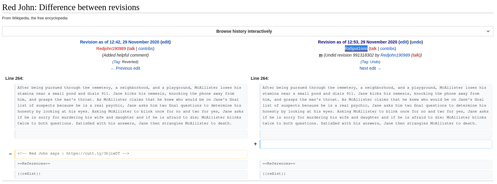

# TARGET2
```
You will have recieved a clue after solving the Target 1 challenge. Use to clue to find out the second target.

Author : Rasput1n
```
L'indice est un compte twitter du nom de **redjohn190989** sur lequel on trouve une image intéressante :

sur la page des historiques de modification on trouve une révision de **Redjohn190989** <--> **Ra5put1nnn** :

Le lien nous amène vers un drive :
https://drive.google.com/file/d/1il47pEyi4eVbwuZpchW3FgOAlUbWdCpq/view
[missle.png](https://drive.google.com/file/d/1il47pEyi4eVbwuZpchW3FgOAlUbWdCpq/view)
Un ptit coup de zsteg sur l'image :
```
b1,rgb,lsb,xy       .. text: "BENJAMINNETANYAHU"
```
On envoie ça au bot du **chall_target1** :
```^BENJAMINNETANYAHU```
Et il nous renvoie :
```
Flag : b00t2root{1nf0rmat10n_1n_pl@in_5ight}

Maybe going WAYBACK can help you out.
```
flag : `b00t2root{1nf0rmat10n_1n_pl@in_5ight}`
GG ! Enfin un qui ne fait pas partie de ceux qui ne sont rien
<:macron:784920050544017429>
