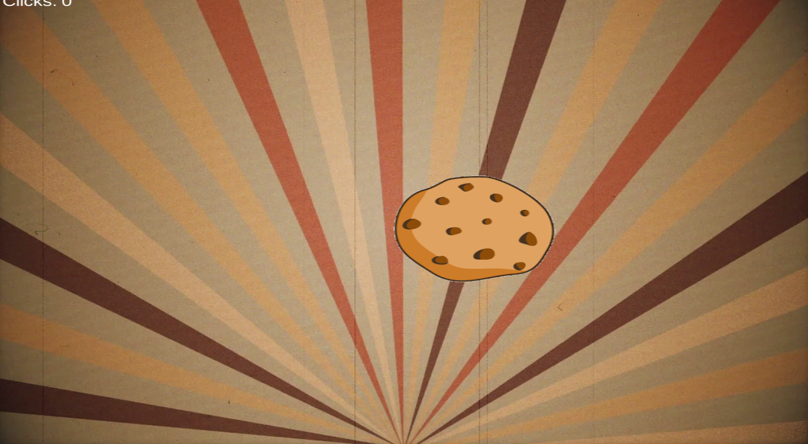
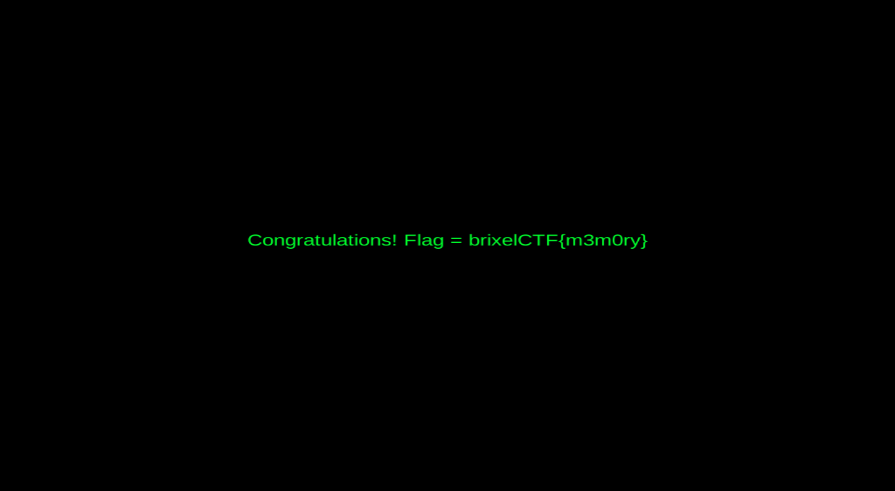

# COOKIES

```
This stupid cookie clicker game...

Legend has it there is a reward when you reach 10000000 or more clicks

Can you think of a way to get that many clicks?
```

Here we have a clicker game



We'll use **scanmem** to write to memory the click number :
```
$ sudo scanmem -p $(pidof visualboyadvance-m)
> 0
info: we currently have 315079020 matches.
315079020> 1
..........ok
info: we currently have 12972 matches.
12972> 2
..........ok
info: we currently have 14 matches.
14> 3
.......ok
info: we currently have 3 matches.
3> list
[ 0] 7f608c01985c, 45 +        1985c,  misc, 3, [I64 I32 I16 I8 ]
[ 1] 7f608cb8abdc, 53 +         cbdc,  misc, 3, [I64 I32 I16 I8 ]
[ 2] 7f608cb98d70, 53 +        1ad70,  misc, 3, [I64 I32 I16 I8 ]
3> set 10000000
info: setting *0x7f608c01985c to 0x989680...
info: setting *0x7f608cb8abdc to 0x989680...
info: setting *0x7f608cb98d70 to 0x989680...
```



flag : `brixelCTF{m3m0ry}`
