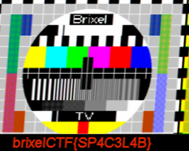

# MESSAGE_FROM_SPACE
```
I received a message from space

Beam me up scottie1!
```

- File : [recording.wav](../attachements/message_from_space/recording.wav)

The recording is a sstv picture :
[Slow-scan television](https://en.wikipedia.org/wiki/Slow-scan_television)

we can decode it with **qsstv** by following this [tuto](https://ourcodeworld.com/articles/read/956/how-to-convert-decode-a-slow-scan-television-transmissions-sstv-audio-file-to-images-using-qsstv-in-ubuntu-18-04)

Result :



flag : `brixelCTF{SP4C3L4B}`
