# FIND_THE_CHICKEN

**Description**

```
Can you find the chicken?

If you want to be on the scoreboard, you may need your team token: https://2020.ctf.link/internal/profile

Read the readme.md!
```

**Download**

- [Find_the_chicken-13043c50b0dc4379.tar.xz](../attachements/find_the_chicken/Find_the_chicken-13043c50b0dc4379.tar.xz)

Inside the tar file is a gameboy emulator for tas and a gamboy rom **Find the chicken**

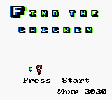


The goal is to record input of a winning game with **tas-emulator** and to send it via netcat to get the flag

We can see that we have 3 lives end we need to get 4 flags to finish the game

Obviously we need to "hack" the game in order to finish it !

## Infinite lives trick

To investigate the game we'll use **visualboyadvance**
and to make things easier we'll get infinite lives with the help of **scanmem** :

* At start we have 3 lives so lets find all variables at **3**
* then we loose a life and check in this list all variables to **2**
* and again we loose a last one.
* Then
 set the variable to **100**

```
$ sudo scanmem -p $(pidof visualboyadvance-m)
> 3
info: we currently have 52281 matches.
52281> 2
info: we currently have 5 matches.
5> 1
info: we currently have 1 matches.
1> list
[ 0] 55c73a561181,  2 +      1962181,  heap, 1, [I8 ]
1> set 100
info: setting *0x55c73a561181 to 0x64...
```

Now we have 100 lives !

## Find the flags
|||
|---|---|
| We go through the level and reach an infinite wall with the first flag behind it| 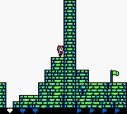|
| Luckily there are hidden destructible block if we go backward, remove them with the **B button** | 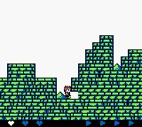|
| And then crawl to clip into the floor to go through the infinite wall | 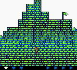 |
| We then get our first flag, 3 remaining | 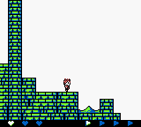|
| After that more destructible blocks, the 2nd flag is behind them | 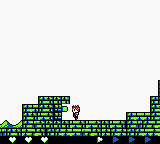 |
| Then the 3rd flag is way up unreachable, we'll see later if we can get it | 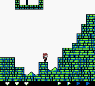 |
| Then an other infinite wall with a sign telling us to **Find the Orb of Truth**, so lets find it ! | 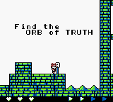 |
| We go back and with **visualboyadvance** tools we visualize the map to find hidden walkable blocks | 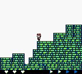 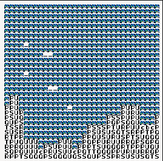 |
| Near the unreachable flag we can see hidden blocks but there are no collision with them | 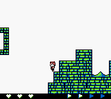 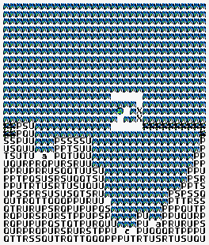 |

### Lets write video ram

So we write the video memory on the fly to reveal these blocks, we change '_' to 'P'

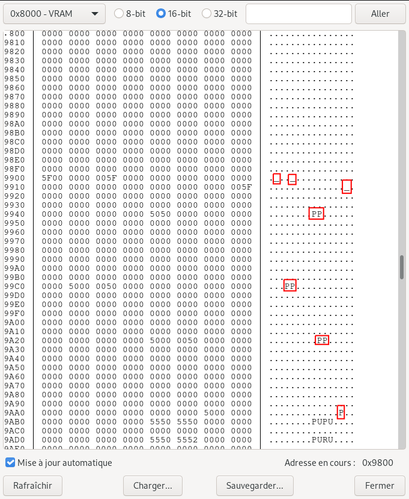

| | |
|-|-|
| Now these blocks are visible and we keep going on this hidden path to find the **Orb of Truth** | 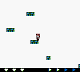|
| We pick it up and go back to the unreachable flag (the 3rd one). |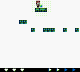 |
| Now thanks to **The Orb of Truth** hidden blocks to get to the 3rd flags are walkable. Moreover the orb reveals the hidden path and by inspecting visual ram we can see that these blocks are **0x5E** breakable blocks, this information will be useful for later | 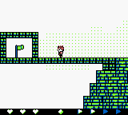 |
| We go on and the orb reveal a path to get over the 2nd tall wall | 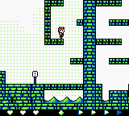 |
| Then we can see the last flag protected by undestructible block | 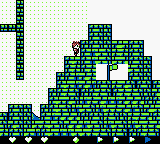 |
| Luckily the orb of truth can be picked up and dropped down. And when you drop it, it will rewrite the tile in front of you. So you can by dropping it and picking it up dig into the wall | 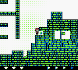 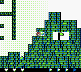 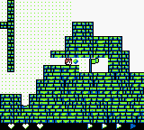 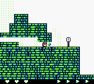 |
| And we reach the end of the game | 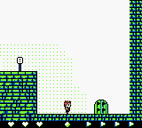 |

## Record inputs

Now we need to record our inputs and send them via netcat by playing it with the **tas-emulator**

Just one problem we have 10min max to finish the game and th hidden path without seeing the blocks will be really complicated.

so we'll patch the gameboy rom to display the hidden blocks
First we naively look for '_' in the rom but we can't find any in the map region...

They must be set at runtime when the map is loaded in the video ram, and indeed we find strange pattern including '_' in the code

```
$ xxd main.gb
[...]
00005b30: e5cd 2a5a e806 af57 1e0a d521 1700 e521  ..*Z...W...!...!
00005b40: d801 e5cd 2a5a e806 af57 1e5f d521 1500  ....*Z...W._.!..
00005b50: e521 8d01 e5cd 2a5a e806 af57 1e5f d521  .!....*Z...W._.!
00005b60: 1100 e521 8901 e5cd 2a5a e806 af57 1e5f  ...!....*Z...W._
00005b70: d521 1100 e521 8a01 e5cd 2a5a e806 af57  .!...!....*Z...W
00005b80: 1e5f d521 0e00 e521 8301 e5cd 2a5a e806  ._.!...!....*Z..
00005b90: af57 1e5f d521 0e00 e521 8401 e5cd 2a5a  .W._.!...!....*Z
00005ba0: e806 af57 1e5f d521 0a00 e521 8801 e5cd  ...W._.!...!....
00005bb0: 2a5a e806 115f 01d5 210a 00e5 2189 01e5  *Z..._..!...!...
00005bc0: cd2a 5ae8 0611 5f01 d521 0800 e521 7601  .*Z..._..!...!v.
00005bd0: e5cd 2a5a e806 115f 01d5 2108 00e5 2179  ..*Z..._..!...!y
00005be0: 01e5 cd2a 5ae8 0611 5f01 d521 0800 e521  ...*Z..._..!...!
00005bf0: 7a01 e5cd 2a5a e806 115f 01d5 2108 00e5  z...*Z..._..!...
00005c00: 217b 01e5 cd2a 5ae8 0611 5f01 d521 0800  !{...*Z..._..!..
00005c10: e521 7e01 e5cd 2a5a e806 115f 01d5 2108  .!~...*Z..._..!.
00005c20: 00e5 2181 01e5 cd2a 5ae8 0611 5f01 d521  ..!....*Z..._..!
00005c30: 0800 e521 8401 e5cd 2a5a e806 af57 1e5f  ...!....*Z...W._
00005c40: d521 0600 e521 7301 e5cd 2a5a e806 af57  .!...!s...*Z...W
[...]
```

Lets try to reveal hidden blocks by replacing '_' with '\x5E'

We'll patch the rom with vim and the xxd trick :
```
$ vim main.gb
:%!xxd
*select the zone to replace*
:'<,'>s/5f/5e/g
:%!xxd -r
:wq
```

- [patched.gb](../attachements/find_the_chicken/patched.gb)

And it worked when we launch the game with **tas-emulator** we can see the hidden blocks (just like we already had the orb)

```
$ ./tas-emulator record winning_run
```

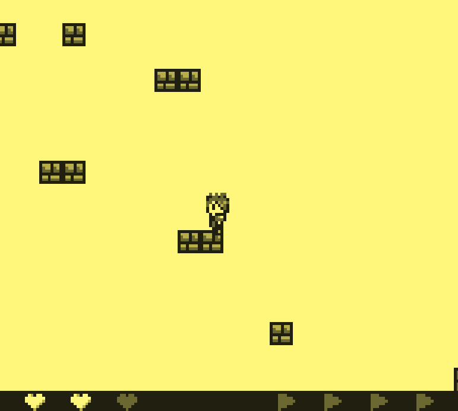

Now we just have to finnish the game and send the record_file via netcat in order to get the flag !

- Fichier : [winning_run](../attachements/find_the_chicken/winning_run)

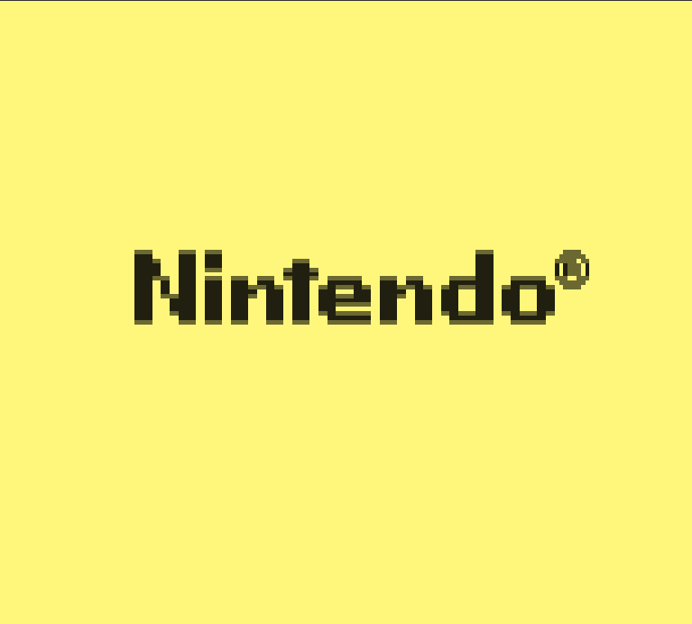

And we get the flag !

flag : `hxp{Y4y_you_f0und_th3_ch1cken}`