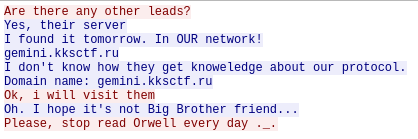

# SECRET_NETWORK_1
J'ai trouvé cette conversation tcp non chiffrée dans le pcap :

Trame 8310
GET /inventational.txt HTTP/1.1
Host: 192.168.122.140:8000
User-Agent: curl/7.66.0
Accept: */*

HTTP/1.0 200 OK
Server: SimpleHTTP/0.6 Python/3.7.7
Date: Mon, 07 Dec 2020 23:28:37 GMT
Content-type: text/plain
Content-Length: 164
Last-Modified: Mon, 07 Dec 2020 22:55:26 GMT

HELLO RESEARCHER

YOU ARE WELCOME ON OUR SECRET SERVER

JUST PROOF WHAT YOU ARE NOT A SEARCHING ROBOT AND GET A REWARD

PASSWORD: gemini

BY KKS WITH LOVE AND BEER
trame 8179
GET / HTTP/1.1
Host: 192.168.122.140:8000
User-Agent: curl/7.66.0
Accept: */*

HTTP/1.0 200 OK
Server: SimpleHTTP/0.6 Python/3.7.7
Date: Mon, 07 Dec 2020 23:28:27 GMT
Content-type: text/html; charset=utf-8
Content-Length: 356

<!DOCTYPE HTML PUBLIC "-//W3C//DTD HTML 4.01//EN" "http://www.w3.org/TR/html4/strict.dtd">
<html>
<head>
<meta http-equiv="Content-Type" content="text/html; charset=utf-8">
<title>Directory listing for /</title>
</head>
<body>
<h1>Directory listing for /</h1>

<ul>
<li><a href="inventational.txt">inventational.txt</a></li>
</ul>

</body>
</html>
tcp.stream eq 1428
hi
good night brother
i get strange message
who send it?
i don't know
But it doesn't matter
It come from our secret network
I put it in our file server
Ok, i will check it
