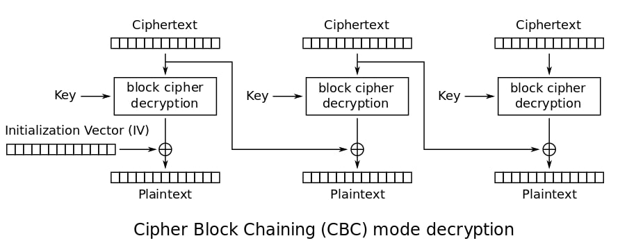

# FLIP_FLOP
```
Description
Yesterday, Roo bought some new flip flops. Let's see how good at flopping you are.

Attachments
https://imaginaryctf.org/r/7B4E-flop.py nc chal.imaginaryctf.org 42011
```

- File : [flop.py](../attachements/flip_flop/flop.py)
```python
#!/usr/local/bin/python
from Crypto.Cipher import AES
from Crypto.Util.Padding import pad, unpad
import binascii
import os

print('''
                                        ,,~~~~~~,,..
                             ...., ,'~             |
                             \    V                /
                              \  /                 /
                              ;####>     @@@@@     )
                              ##;,      @@@@@@@    )
                           .##/  ~>      @@@@@   .   .
                          ###''#>              '      '
      .:::::::.      ..###/ #>               '         '
     //////))))----~~ ## #}                '            '
   ///////))))))                          '             '
  ///////)))))))\                        '              '
 //////)))))))))))                                      '
 |////)))))))))))))____________________________________).
|||||||||||||||||||||||||||||||||||||||||||||||||||||||||

(yeah they're not flip flops but close enough)

''')

key = os.urandom(16)
iv = os.urandom(16)
flag = open("flag.txt").read().strip()


for _ in range(3):
	print("Send me a string that when decrypted contains 'gimmeflag'.")
	print("1. Encrypt")
	print("2. Check")
	choice = input("> ")
	if choice == "1":
		cipher = AES.new(key, AES.MODE_CBC, iv)
		pt = binascii.unhexlify(input("Enter your plaintext (in hex): "))
		if b"gimmeflag" in pt:
			print("I'm not making it *that* easy for you :kekw:")
		else:
			print(binascii.hexlify(cipher.encrypt(pad(pt, 16))).decode())
	else:
		cipher = AES.new(key, AES.MODE_CBC, iv)
		ct = binascii.unhexlify(input("Enter ciphertext (in hex): "))
		assert len(ct) % 16 == 0
		if b"gimmeflag" in cipher.decrypt(ct):
			print(flag)
		else:
			print("Bad")

print("Out of operations!")
```

A key and an IV is picked at random for an AES CBC encryption algorithm.

You can encrypt a chosen text and get the cypher.

In order to get the flag you need to enter a cipher that when decrypted contains 'gimmeflag'.

Obviously you can't encrypt 'gimmeflag' directly....

Here we will perform a **bitflip attack** (as suggested by the name of the challenge)

## Steps
- The first step is to encrypt a string containing 'gimmeflag' but with a difference of one bit
- Flip the bit
- And decrypt the flipped cipher to obtain 'gimmeflag'
The AES CBC decryption works with 16 bytes blocks likewise :


So we ask the script to encrypt this string :
```
[ A A A A A A A A A A A A A A A A ] [ f i m m e f l a g ]
```

Because **f (110 0110)** and **g (110 0111)** are one bit off in ascii

We then flip the first bit of the first character in the first block of the cipher.

And we ask the script to decrypt it to obtain the flag !

Here is the script :

- File : [solve.py](../attachements/flip_flop/solve.py)
```python
from pwn import *

p = remote('chal.imaginaryctf.org', 42011)

p.recvuntil('Check\n').decode()
p.recvuntil('> ').decode()
p.send(b'1\n')
p.recvuntil(': ').decode()

log.info("Sending 'fimmeflag'")
p.send(b'0'*32+binascii.hexlify(b'fimmeflag')+b'\n')

log.info("Flipping 1st byte in cipher")
cipher = binascii.unhexlify(p.recvuntil('\n')[:-1])
cipher = (cipher[0]^0b1).to_bytes(1,'little')+cipher[1:]
cipher = binascii.hexlify(cipher)

p.recvuntil('> ').decode()
p.send(b'2\n')
p.recvuntil(': ').decode()

log.info("Sending flipped cipher")
p.send(cipher+b'\n')
flag = p.recvuntil('\n').decode()
log.success('Flag = '+flag)
```

```
$ python solve.py
[+] Opening connection to chal.imaginaryctf.org on port 42011: Done
[*] Sending 'fimmeflag'
[*] Flipping 1st byte in cipher
[*] Sending flipped cipher
[+] Flag = ictf{fl1p_fl0p_b1ts_fl1pped_b6731f96}
```

flag : `ictf{fl1p_fl0p_b1ts_fl1pped_b6731f96}`
